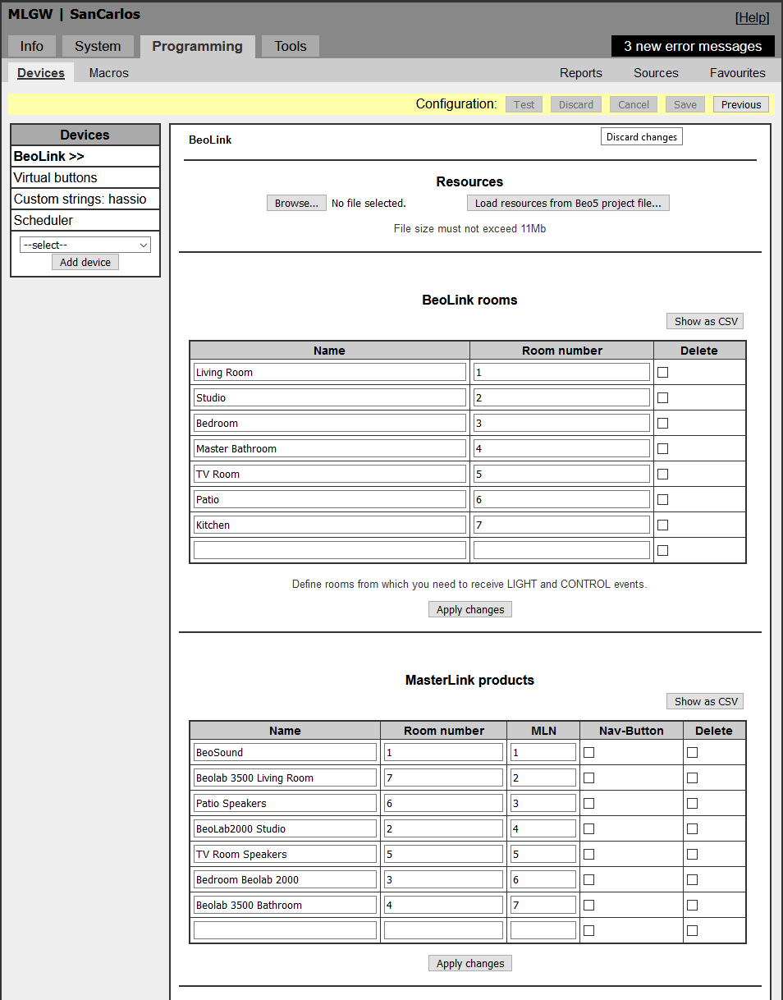
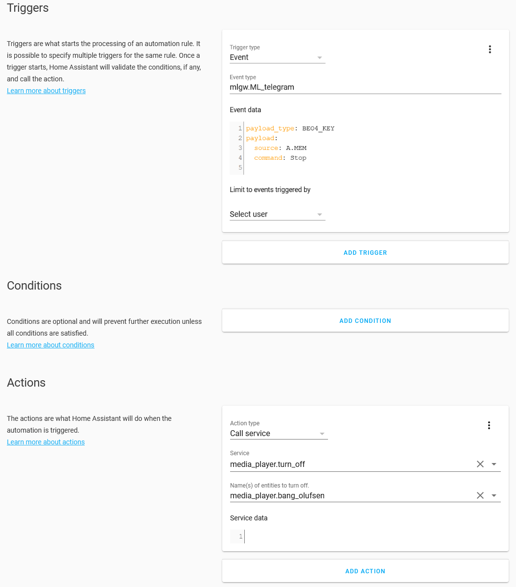

# Bang & Olufsen MasterLink Gateway / BeoLink Gateway - Home Assistant component

This component integrates Bang & Olufsen Master Link Gateway and Beolink Gateway to Home Assistant. 

[Masterlink Gateway Product Description](http://mlgw.bang-olufsen.dk/source/documents/mlgw_2.24b/ML%20Gateway_Installation%20Guide%202v2.pdf)

[BeoLink Gateway Product Description](https://corporate.bang-olufsen.com/en/partners/for-professionals/smart-home)

This component connects to the MasterLink and Beolink Gateway and makes all your Bang & Olufsen audio and video devices into "media_player" entities in Home Assistant. It uses an undocumented feature that enables functionality normally not provided even by the Bang & Olufsen official apps, like using your B&O remotes to control streaming devices on Home Assistant. If you don't have one, can buy a used ML Gateway on ebay for $100-200. While newer 'Network Link' devices are supported through the gateway, I recommend using the [BeoPlay plugin](https://github.com/giachello/beoplay) instead which natively supports the more advanced NL features.


## Installation

Create a `mlgw` directory in `/config/custom_components/` and copy all the files in this repository into it.


### Automatic configuration through Add Integrations (preferred)

On Home Assistant, go to "Configuration->Integrations-> (+)" and look for MLGW

The configuration flow will ask for the host or IP address, username and password and whether to use the "Direct ML feature" (see below). If you select it, you have to use the admin account to login. Explicitly select or unselect the feature before continuing.

The plugin will automatically pick up the configuration from the the MLGW. The devices and their sources must be configured in the MLGW/BLGW setup page (Programming->Devices->Beolink and Programming->Sources) as seen in the pictures below. The sources will be reflected in the Home Assistant UI.





### Manual configuration through Configuration.yaml (deprecated, I'll likely remove this in the future)

This is an alternative to the configuration above if you prefer manual configuration. Add to Configuration.yaml (replace with your specific setup):
``` 
mlgw:
  host: 192.168.1.10
  username: admin
  password: <your password>
  use_mllog: true
  default_source: A.MEM
  available_sources: 
    - A.MEM
    - CD
    - RADIO
  devices:
    - name: Living Room
    - name: Kitchen
    - name: Patio
    - name: Studio
    - name: TV Room
    - name: Bedroom
    - name: Bathroom
 ```

Add the devices in the same order as the devices in the MLGW/BLGW configuration. The MLGW setup page is found in Setup -> Programming -> Devices -> MasterLink products. Each device must have a unique MLN and must be assigned using the buttons under _MasterLink products assignment_ further down on the same page.

If you don't set a MLN (masterlink node number) for the devices, they need to be defined in the same order as the MLGW configuration, and MLNs will be assigned sequentially, starting from 1 for the first one. For example, the yaml configuration above, correspond to the MLGW configuration in the picture above. 

If you want to set specific MLNs then you can change the devices section to something like this. Note that if you give wrong MLNs the plugin won't work or might operate the wrong device.

```
  devices:
    - name: Living Room
      mln: 9
    - name: Kitchen
      mln: 11
```

You can also add a room number, corresponding to your MLGW configuration, and force a Masterlink ID for a device.

```
  devices:
    - name: Living Room
      room: 9
      id: VIDEO_MASTER
    - name: Kitchen
      room: 1
```

Put any Network Link devices at the end of the list. They typically start at MLN 20. If you don't, the Direct Master Link Connection feature will get confused and the system will not work as intended.


## Special Undocumented Feature: Direct Master Link Connection

This integration uses a special undocumented feature of the Master Link Gateway that allows to listen into the actual ML traffic on the Masterlink bus and provides enhanced functionality. Specifically, it allows Home Assistant to fire events for things happening on the bus that wouldn't be provided by the stock MLGW official API, like speakers turning off, or key presses on the remote control, other than Light/Control. 

It allows all kinds of fun integrations. For example you can start and control your Spotify or other streaming integrations through your Beo4 or BeoOne remote control.

For this to work, you must use **'username: admin'**, and the admin password as credentials for the MLGW and set **'use_mllog: true'** in the configuration.

The integration works also without this feature, but it's much better with it.


## Using the integration

### Speakers and Bang & Olufsen Sources

Beolink speakers (e.g., a [Beolab 3500](https://www.beoworld.org/prod_details.asp?pid=373) in your kitchen) will show up as normal "media_player" devices that you can integrate in your normal lovelace interface. I use [mini media player ](https://github.com/kalkih/mini-media-player) because I like that it groups all items together. You can control volume and turn on the B&O sources from your Home Assistant dashboard.


Remember that only one source is shared on all the Masterlink speakers (it's a single zone system) so you can't play different sources on different speakers at the same time.

The implemented `media_player` commands include:

` turn_on, turn_off, select_source, volume_up, volume_down, volume_mute, media_previous_track, media_next_track, media_play, media_stop, media_pause, shuffle_set, repeat_set`

## Using the integration through Events

The integration also forwards events to Home Assistant that you can use for your automations.

### MasterLink Gateway official commands: Lights and Virtual Buttons

The normal MasterLink Gateway Protocol forwards the following commands: Virtual Buttons, Light / Control commands, Picture and Sound Status, Source Status, and "All Standby". 

The `mlgw` component forwards these commands as events on the Home Assistant Events bus and you can use them by listening to them. You can see what events fire with the Home Assistant "Events" UI. (Developer tools->Events->Listen to Events and type: `mlgw.MLGW_telegram` in the field on the bottom of the page).

For example, if the user selects `LIGHT-1` on their Beo4 or BeoRemoteOne remote control, an Event in Home assistant will allow you to control your lights or a scene. Note that Light and Control events are only supported by the [devices listed here](http://mlgw.bang-olufsen.dk/source/documents/MLGW%20product%20compatibility.doc).

The following Event Automation catches "All Standby" (which means the entire B&O system is turned off). You can use it to turn off Spotify streaming:


There are 5 events fired by the official integration:

| Event | Payload Type | Arguments |
| ----- | ------------ | --------- |
| mlgw.MLGW_telegram | all_standby | *none* |
| mlgw.MLGW_telegram | virtual_button | button: button number, action: (PRESS,RELEASE,HOLD) |
| mlgw.MLGW_telegram | light_control_event | room: room number, type: (CONTROL or LIGHT), command: the BEO4 key pressed after "LIGHT" |
| mlgw.MLGW_telegram | source_status | source_mln: device causing the event, source: the active Source (RADIO, CD, etc.), source_medium_position, source_position, source_activity: (Playing, Standby, etc.), picture_format are all information related to the specific source  |
| mlgw.MLGW_telegram | pict_sound_status | source_mln: device causing the event, sound_status, speaker_mode, volume, screen1_mute, screen1_active, screen2_mute, screen2_active, cinema_mode, stereo_mode |


### Undocumented enhanced functionality

The enhanced Undocumented Feature forwards *ALL* MasterLink events that happen on the bus so you can use them to drive much more interesting behavior. For example, you could:
* start Spotify by pressing the "green" button on your Beo4 remote after having selected A.MEM (the button that typically activates the Aux input on the B&O equipment where you can connect a streaming devices like a Chromecast Audio). 
* use the "Blue" button to turn off a speaker and turn on another one when moving within the house
* use the number buttons to select different 'streaming radios' through the ['netradio'](https://github.com/giachello/netradio) plugin.
* use the up, down, wind, rewind buttons to switch Spotify playlists or move to the next song in the playlist.

The possibilities are endless. You can see a few examples here: [https://github.com/giachello/mlgw/blob/main/example_automations.yaml](example_automations.yaml). An easy way to see what goes on the ML bus is using the "Events" UI. (Developer tools->Events->Listen to Events and type: `mlgw.ML_telegram` in the field on the bottom of the page.

For example the following setup catches the Green key event on the Beo4 remote.


Another example is to stop playback when the "Stop" button is pressed on the remote (in this case, "media_player.bang_olfusen" is the Chromecast connected to the input of the B&O audio system):




A full list of BEO4 Keys is available starting at line 197 in this file: [https://github.com/giachello/mlgw/blob/main/const.py](https://github.com/giachello/mlgw/blob/main/const.py)

There are too many ML telegram types to document here (and a lot are undocumented publicly), but a few particularly useful ones are listed below (see const.py and gateway.py for more information).


| Event | Payload Type | Arguments | Payload Argument | Description |
| ----- | ------------ | --------- | ---------------- | ----------- |
| mlgw.ML_telegram | GOTO_SOURCE | from_device, to_device | source, channel_track | Speaker requests a certain source |
| mlgw.ML_telegram | RELEASE | from_device, to_device | | Speaker turns off |
| mlgw.ML_telegram | STATUS_INFO | from_device, to_device | source, channel_track, activity, source_medium, picture_identifier | Reports source status changes |
| mlgw.ML_telegram | TRACK_INFO | from_device, to_device | subtype (Change Source, Current Source) , prev_source, source | Reports changes in the source |
| mlgw.ML_telegram | STANDBY | from_device, to_device |  | Device turns off |
| mlgw.ML_telegram | BEO4_KEY | from_device, to_device | source, command  | Beo4 key pressed on a speaker | 
| mlgw.ML_telegram | TIMER | from_device, to_device |  | Timer functionality invoked |
| mlgw.ML_telegram | MLGW_REMOTE_BEO4 | from_device, to_device | command, dest_selector | issued when an external device (e.g., the B&O phone app or Home Assistant) sends a BEO4 command through the MLGW |
| mlgw.ML_telegram | TRACK_INFO_LONG | from_device, to_device | source, channel_track, activity | Information about the Radio or CD track that is playing | 


_You can see what is being fired by the MasterLink bus by enabling "DEBUG" logging in Configuration.yaml. Then just look at your home-assistant.log file_

```
logger:
  default: warning
  logs:
    custom_components.mlgw: debug
```

## Sending Virtual Button Commands

You can send virtual button commands to the MLGW/BLGW by using the `mlgw.virtual_button` service. This is useful if you want to control macros on the MLGW. 


## Not implemented / TODO

* Zeroconf autoconfiguration flow
* Timer and Clock packets unpacking

## Known Issues

* When a Audio Master or a Video Master starts playing a source that it owns (e.g., a BeoSound 3000 turning on A.MEM), it doesn't tell the ML bus that is happening, so we cannot detect it in the plugin. Unfortunately, we can only detect reliably when a speaker turns on to a source owned by a Master somewhere else.
* When a Video Master has several sources active at the same time (e.g., a Decoder on 'TV' being played locally and a tuner on 'DTV' being distributed on the system) it reports both sources at the same time and that confuses the plugin. 


