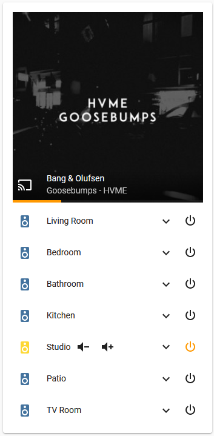
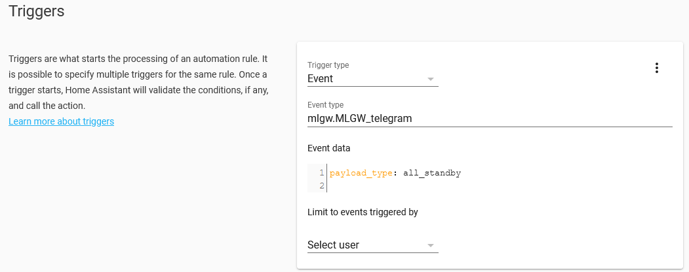
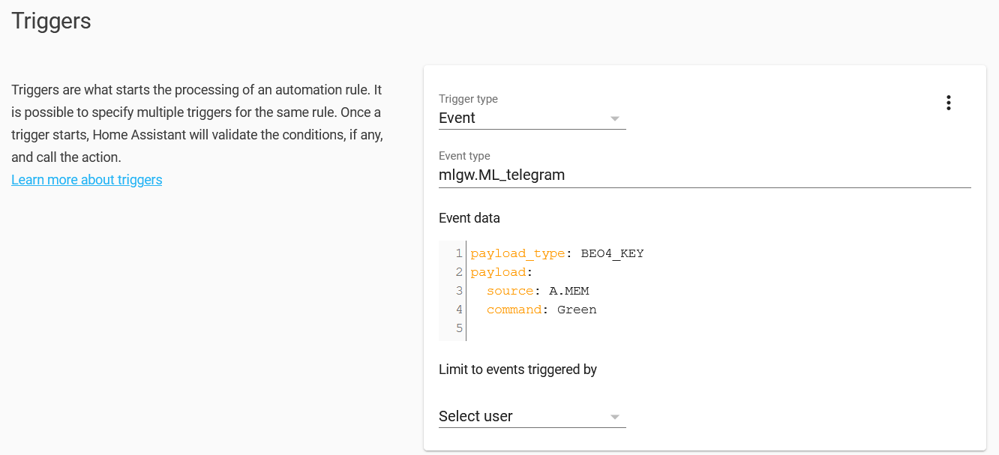

# Bang & Olufsen MasterLink Gateway / BeoLink Gateway Home Assistant component

This components integrates Bang & Olufsen Master Link Gateway and Beolink Gateway to the Home Assistant.

[Masterlink Gateway Product Description](http://mlgw.bang-olufsen.dk/source/documents/mlgw_2.24b/ML%20Gateway_Installation%20Guide%202v2.pdf)

[BeoLink Gateway Product Description](https://corporate.bang-olufsen.com/en/partners/for-professionals/smart-home)

This component manages communication To and From the MLGW and Beolink Gateway. It includes support for a special undocumented feature of the Bang & Olufsen devices that allows for functionality normally not provided even by the Bang & Olufsen official apps (see below).

## Installation

Create a `mlgw` directory in `/config/custom_components/` and copy all the files in this repository into it.

Then update your Configuration.yaml as follows (replace your specific host address and other information):
``` 
mlgw:
  host: 192.168.1.10
  username: admin
  password: <your password>
  use_mllog: true
  default_source: A.MEM
  available_sources: 
    - A.MEM
    - CD
    - RADIO
  devices:
    - name: Living Room
    - name: Kitchen
    - name: Patio
    - name: Studio
    - name: TV Room
    - name: Bedroom
    - name: Bathroom
 ```


### Configure Masterlink Gateway

Add the B&O devices to the gateway and assign the MLN numbers to the devices in the same order as the devices in the HA configuration. The MLGW setup page is found in Setup -> Programming -> Devices -> MasterLink products. Each device must have a unique MLN and must be assigned using the buttons under _MasterLink products assignment_ further down on the same page.

If you don't set a MLN (masterlink node number) for the devices, they need to be defined in the same order as the MLGW configuration, and MLNs will be assigned sequentially, starting from 1 for the first one. For example the devices above, correspond to this configuration in the MLGW:


If you need to set specific MLNs then you can change the devices section to something like this:

```
  devices:
    - name: Living Room
      mln: 9
    - name: Kitchen
      mln: 11
```

You can also add a room number, corresponding to your MLGW configuration.

```
  devices:
    - name: Living Room
      room: 9
    - name: Kitchen
      room: 1
```

## Special Undocumented Feature: Direct Master Link Connection

This integration uses a special undocumented feature of the Master Link Gateway that allows to listen into the actual ML traffic on the Masterlink bus and provides enhanced functionality. Specifically, it allows Home Assistant to fire events for things happening on the bus that wouldn't be provided by the stock MLGW official API, like speakers turning off, or key presses other than Light/Control presses. It allows all kinds of fun integrations like starting and controlling your Spotify or other streaming integrations through the Beo4 remote controls. 

For this to work, you must use 'username: admin', and the admin password, and set up use_mllog: true in the configuration.

The integration works also without this feature, but it's much better with it.


## Using the integration

Beolink speakers (e.g., a [Beolab 3500](https://www.beoworld.org/prod_details.asp?pid=373) in your kitchen) will show up as normal "media_player" devices that you can integrate in your normal lovelace interface. I use [mini media player ](https://github.com/kalkih/mini-media-player) because I like that it groups all items together.



Remember that only one source is shared on all the Masterlink speakers (it's a single zone system) so you can't play different sources on different speakers at the same time.


## Using the integration through Events

The integration also forwards events to Home Assistant that you can use for your automations.

### MasterLink Gateway official commands

* The vanilla MasterLink Gateway Protocol only forwards: Virtual Buttons, Light commands, Control commands, and "All Standby" commands. The component forwards these commands as events on the Home Assistant Events bus and you can use them by listening to Virtual Button and Light events fired by the platform.

For example, this event catches "All Standby" (which means the entire B&O system is turned off). You can use it to turn off spotify streaming:




There are only 3 events of this type:

| Event | Payload Type | Arguments |
| ----- | ------------ | --------- |
| mlgw.MLGW_telegram | all_standby | *none* |
| mlgw.MLGW_telegram | virtual_button | button: button number, action: (PRESS,RELEASE,HOLD) |
| mlgw.MLGW_telegram | light_control_event | room: room number, type: (CONTROL or LIGHT), command: the BEO4 key pressed after "LIGHT" |


### Undocumented enhanced functionality

* The enhanced Undocumented Feature also forwards *ALL* MasterLink events that happen on the bus so you can use them to drive much more interesting behavior. 

For example, you can start Spotify by pressing the "green" button on your Beo4 remote after having selected A.MEM (the button that typically activates the Aux input on the B&O equipment where you can connect a streaming devices like a Chromecast Audio).



Another example is to stop playback when the "Stop" button is pressed on the remote (in this case, "media_player.bang_olfusen" is the Chromecast connected to the input of the B&O audio system):


A full list of Key commands is available starting at line 122 in this file: [https://github.com/giachello/mlgw/blob/main/const.py](https://github.com/giachello/mlgw/blob/main/const.py)

There are too many ML commands to document here (see const.py and gateway.py), but a few particularly useful ones are listed below.

_NOTE: the from_device and to_device in the Masterlink traffic are not the same as the "MLN" used above. In the future, I'll provide functionality to reconnect the two numbers_

| Event | Payload Type | Arguments | Payload Argument | Description |
| ----- | ------------ | --------- | ---------------- | ----------- |
| mlgw.ML_telegram | GOTO_SOURCE | from_device, to_device | source, channel_track | Speaker requests a certain source |
| mlgw.ML_telegram | RELEASE | from_device, to_device | | Speaker turns off |
| mlgw.ML_telegram | STATUS_INFO | from_device, to_device | source, channel_track, activity, source_medium, picture_identifier | Reports source status changes |
| mlgw.ML_telegram | TRACK_INFO | from_device, to_device | subtype (Change Source, Current Source) , prev_source, source | Reports changes in the source |
| mlgw.ML_telegram | STANDBY | from_device, to_device |  | Device turns off |
| mlgw.ML_telegram | BEO4_KEY | from_device, to_device | source, command  | Beo4 key pressed on a speaker | 
| mlgw.ML_telegram | TIMER | from_device, to_device |  | Timer functionality invoked |
| mlgw.ML_telegram | MLGW REMOTE BEO4 | from_device, to_device | command, dest_selector  | issued when an external device (e.g., the B&O phone app or Home Assistant) sends a BEO4 command through the MLGW |
| mlgw.ML_telegram | TRACK_INFO_LONG | from_device, to_device | source, channel_track, activity | Information about the Radio or CD track that is playing | 


## Not implemented / TODO

* A proper config_flow to allow for UI-based configuration
* Timer and Clock packets unpacking

